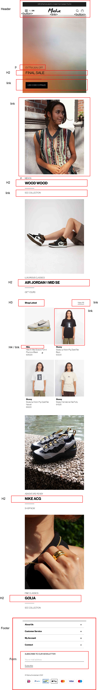

# Procesverslag
Markdown is een simpele manier om HTML te schrijven.  
Markdown cheat cheet: [Hulp bij het schrijven van Markdown](https://github.com/adam-p/markdown-here/wiki/Markdown-Cheatsheet).

Nb. De standaardstructuur en de spartaanse opmaak van de README.md zijn helemaal prima. Het gaat om de inhoud van je procesverslag. Besteedt de tijd voor pracht en praal aan je website.

Nb. Door *open* toe te voegen aan een *details* element kun je deze standaard open zetten. Fijn om dat steeds voor de relevante stuk(ken) te doen.

## Jij

  
uitwerken voor kick-off werkgroep

  ### Auteur:
  Dani Pinto Gomes

  #### Je startniveau:
  blauw

  #### Je focus:
  surface plane
 

## Je website

  
uitwerken voor kick-off werkgroep

  ### Je opdracht:
  https://www.maha-amsterdam.com

  #### Screenshot(s) van de eerste pagina (small screen): 
  hier de naam van de pagina  
  

  #### Screenshot(s) van de tweede pagina (small screen):
  hier de naam van de pagina  
  
 

## Toegankelijkheidstest 1/2 (week 1)

  
uitwerken na test in 1e werkgroep

  ### Bevindingen
  Over het algemeen optimaal contrast zwarte tekst - witte achtergrond. Niet veel kleurgebruik.
  In enkele gevallen valt zwarte tekst over donkere afbeeldingen en is het moeilijk te lezen.

  #### Screenreader
Geeft geen informatie met mouseover.

  #### Muis en Toetsenbord 
Tab: van zoekbalk meteen naar de footer met nieuwsbrief inschrijven. Site is niet te gebruiken zonder de muis.

  #### Motoriek (shocks, elastiekjes)
  Knoppen zijn redelijk tot groot en navigeren gaat goed met een slechte motoriek.

  #### Visueel (brillen, contrast, kleurenblind, dark/light). 
Bril met witte vlekken maakt lezen lastiger, maar lukt wel met focus. Teksten nogal klein en dun.
Gele bril maakt kleuren van artikelen anders, maar dit zijn nou eenmaal de kleuren die de artikelen hebben.

## Breakdownschets (week 1)

  
uitwerken na afloop 2e werkgroep

  ### de hele pagina: 
  

## Voortgang 1 (week 2)

  
uitwerken voor 1e voortgang

  ### Stand van zaken
  Vraagtekens bij responsive, pagina images width in px meegegeven. Flexbox in de header ging goed. 
  Vraagtekens over positioneren vier afbeeldingen.
  
  position sticky werkt niet?

  ### Verslag van meeting
  hier na afloop snel de uitkomsten van de meeting vastleggen

  - classes vervangen door nth: first of type
  - oplossing position sticky: top: 0;

## Voortgang 2 (week 3)

  
uitwerken voor 2e voortgang

  ### Stand van zaken
  Vier afbeeldingen zo netjes mogelijk positioneren?

  ### Verslag van meeting

  - hamburger menu in button plaatsen, was gewoon een image.
  - Vier afbeeldingen GRID gebruiken met li's erin.
  - Afbeeldingen geen px width meegeven, maar 100%!

## Toegankelijkheidstest 2/2 (week 4)

  
uitwerken na test in 8e werkgroep

  ### Bevindingen
  Tekst eerste artikel veel fijner te lezen dan op de oorspronkeljjke website.
  Met tab (productpagina) goed te gebruiken. 

   
   

  #### Screenreader

  #### Muis en Toetsenbord 

  #### Motoriek (shocks, elastiekjes)

  #### Visueel (brillen, contrast, kleurenblind, dark/light). 
Tekst eerste artikel veel fijner te lezen dan op de oorspronkeljjke website.

   
   

## Voortgang 3 (week 4)

  
uitwerken voor 3e voortgang

  ### Stand van zaken
  Helaas ziek en afwezig. Hamburger menu lukt nog niet, aankomende week hulp van CMD student.

  ### Verslag van meeting
  hier na afloop snel de uitkomsten van de meeting vastleggen

  - Ziek met koorts op bed

## Eindgesprek (week 5)

  
uitwerken voor eindgesprek

  ### Je uitkomst - karakteristiek screenshots:
  
  

  ### Dit ging goed/Heb ik geleerd: 
  - Een nieuwe manier van aanroepen (nth-of-type)
  - Een font downloaden en toepassen
  - Stilstaan bij verschillende (beperkte) gebruikers
  - Hamburger menu maken
  - Carousel maken
  - Enz...

  ### Dit was lastig/Is niet gelukt:
  De footer is helaas niet interactief en klapt niet uit.
  Ik had ook graag meerdere animaties toe willen voegen, maar ik heb persoonlijk toch grote stappen gemaakt.

  

## Bronnenlijst

  
continu bijhouden terwijl je werkt

  Nb. Wees specifiek ('css-tricks' als bron is bijv. niet specifiek genoeg).

  1. https://flexboxfroggy.com/#nl
  2. Studentassistenten + Robert
  3. https://codepen.io/robertspier/pen/NWMapEM

